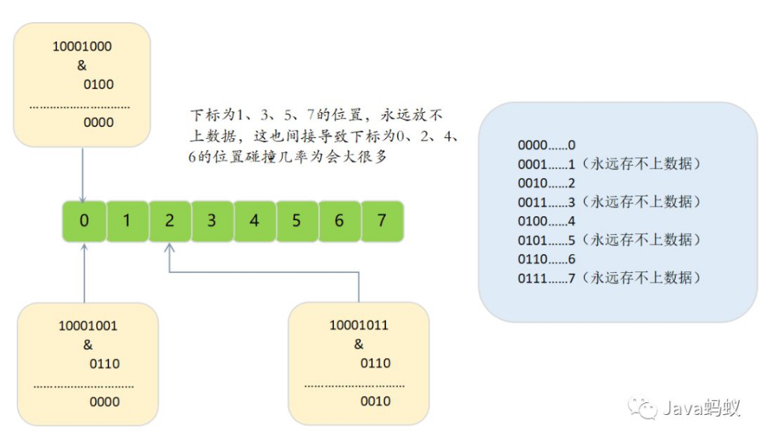

## 为什么hashtable的数组长度一定是2的次幂

取`hashtable`中数据时有这样一个核心公式：

    数组长度减一做与运算: tab[ idx = (tableSize - 1) & hashCode ]
    
这里是计算数组索引下标的位置.`&`为二进制中的与运算.运算规则：
    
    0&0=0;
    0&1=0;
    1&0=0;
    1&1=1;

即：同1为1,否则为0.其实这也是利用了取模的散列思想,显然`位运算`要比`取模`更快.

**因为`hashtable`的数组长度都是2的n次幂,那么对于这个数再减去1,转换成二进制的话就肯定是最高位为`0`，其他位全是`1`的二进制数**。
以数组长度为8为例，那`8-1`转成二进制的话，就是`0111`.

那我们随便举几个hashCode值，与`0111`进行与运算看看结果如何：

第一个key：        

    hashcode值:   10101001    
               &      0111                                      
               =>     0001  （十进制为1）

第二个key：        

    hashcode值:   11101000    
               &      0111                                      
               =>     0000  （十进制为0）

第三个key：        

    hashcode值:   11101110    
               &      0111                                      
               =>     0110  （十进制为6）

**这样得到的数，就可以完整的得到原hashcode值的低位值**，不会受到与运算对数据的变化影响.

再看一下如果数组长度不是`2^n`时,该公式的计算结果.假设数组长度为`7`.数字`7`减去`1`转换成二进制是`0110`，即下边的情况：

第一个key：        

    hashcode值:   10101001    
               &      0110                                      
               =>     0000  （十进制为0）

第二个key：        

    hashcode值:   11101000    
               &      0110                                      
               =>     0000  （十进制为0）

第三个key：        

    hashcode值:   11101110    
               &      0110                                      
               =>     0110  （十进制为6）

通过上边可以看到，当数组长度不为2的n次幂的时候，同样的三个`hashCode值`与`数组长度减一做与运算`的时候，会出现重复的索引位置.
这是因为不为2的n次幂的话,对应的二进制数的非最高位中肯定有一位为`0`,这样不管你的hashCode值对应的该位`是0还是1`,最终得到的该位上的数肯定是0.
这带来的问题就是**`hashtable`上的数组元素分布不均匀，而数组上的某些位置，永远也用不到**.

换句话说,这将带来的问题就是hashtable数组的利用率太低，并且链表可能因为上边的`(n - 1) & hash`运算结果碰撞率过高，
导致链表太深,出现性能问题.**所以说hashtable的长度一定是2的次幂**.

#### 参考资料

原文链接：https://blog.csdn.net/Tane_1018/article/details/103392267