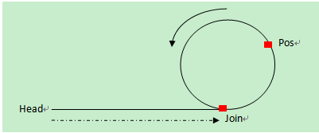
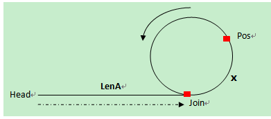

## 如何求单链表的环长

#### 如何判断单链表是否有环

使用快慢双指针法,快慢指针必定会相遇在环上的某个结点 慢指针每次移动一步，快指针每次移动两步

#### 求环长

在环上相遇后，记录第一次相遇点为Pos，之后指针slow继续每次走1步，fast每次走2步。在下次相遇的时候fast比slow正好又多走了一圈，也就是多走的距离等于环长。
设从第一次相遇到第二次相遇，设slow走了len步，则fast走了2*len步，相遇时多走了一圈：

    环长=2*len-len。
    
也就是说,从第一次相遇时开始,维护一个计数器,slow指针每移动一步，计数器+1,再次相遇时，计数器的值就为环长.    

#### 求头结点到环入口的距离

`第一次碰撞点Pos到连接点Join的距离=头指针到连接点Join的距离`，因此，分别从第一次碰撞点Pos、头指针head开始走，相遇的那个点就是连接点。    

#### 求单链表的长度

    头结点到环入口的距离La + 环长R
    
#### demo

    #include <stdio.h>
    #include <stdlib.h>
    typedef struct node{
        int value;
        struct node *next;
    }LinkNode,*Linklist;
    
    /// 创建链表(链表长度，环节点起始位置)
    Linklist createList(){
        Linklist head = NULL;
        LinkNode *preNode = head;
        LinkNode *FifthNode = NULL;
        for(int i=0;i<6;i++){
            LinkNode *tt = (LinkNode*)malloc(sizeof(LinkNode));
            tt->value = i;
            tt->next = NULL;
            if(preNode == NULL){
                head = tt;
                preNode = head;
            }
            else{
                preNode->next =tt;
                preNode = tt;
            }
    
            if(i == 3)
                FifthNode = tt;
        }
        preNode->next = FifthNode;
        return head;
    }
    
    ///判断链表是否有环
    LinkNode* judgeRing(Linklist list){
        LinkNode *fast = list;
        LinkNode *slow = list;
    
        if(list == NULL)
            return NULL;
    
        while(true){
            if(slow->next != NULL && fast->next != NULL && fast->next->next != NULL){
                slow = slow->next;
                fast = fast->next->next;
            }
            else
                return NULL;
    
            if(fast == slow)
                return fast;
        }
    }
    
    ///获取链表环长
    int getRingLength(LinkNode *ringMeetNode){
        int RingLength=0;
        LinkNode *fast = ringMeetNode;
        LinkNode *slow = ringMeetNode;
        for(;;){
            fast = fast->next->next;
            slow = slow->next;
            RingLength++;
            if(fast == slow)
                break;
        }
        return RingLength;
    }
    
    ///获取链表头到环连接点的长度
    int getLenA(Linklist list,LinkNode *ringMeetNode){
        int lenA=0;
        LinkNode *fast = list;
        LinkNode *slow = ringMeetNode;
        for(;;){
            fast = fast->next;
            slow = slow->next;
            lenA++;
            if(fast == slow)
                break;
        }
        return lenA;
    }
    
    ///环起始点
    ///如果有环, 释放空空间时需要注意.
    LinkNode* RingStart(Linklist list, int lenA){
        if (!list || lenA <= 0){
            return NULL;
        }
    
        int i = 0;
        LinkNode* tmp = list;
        for ( ; i < lenA; ++i){
            if (tmp != NULL){
                tmp = tmp->next;
            }
        }
    
        return (i == lenA)? tmp : NULL;
    }
    
    ///释放空间
    int freeMalloc(Linklist list, LinkNode* ringstart){
        bool is_ringstart_free = false; //环起始点只能被释放空间一次
        LinkNode *nextnode = NULL;
    
        while(list != NULL){
            nextnode = list->next;
            if (list == ringstart){ //如果是环起始点
                if (is_ringstart_free)
                    break;  //如果第二次遇到环起始点addr, 表示已经释放完成
                else
                    is_ringstart_free = true;   //记录已经释放一次
            }
            free(list);
            list = nextnode;
        }
    
        return 0;
    }
    
    int main(){
        Linklist list = NULL;
        LinkNode *ringMeetNode  = NULL;
        LinkNode *ringStartNode = NULL;
    
        int LenA       = 0;
        int RingLength = 0;
    
        list = createList();
        ringMeetNode = judgeRing(list); //快慢指针相遇点
    
        if(ringMeetNode == NULL)
            printf("No Ring\n");
        else{
            printf("Have Ring\n");
            RingLength = getRingLength(ringMeetNode);   //环长
            LenA = getLenA(list,ringMeetNode);
    
            printf("RingLength:%d\n", RingLength);
            printf("LenA:%d\n", LenA);
            printf("listLength=%d\n", RingLength+LenA);
        }
    
        ringStartNode = RingStart(list, LenA);  //获取环起始点
        freeMalloc(list, ringStartNode);    //释放环节点, 有环时需要注意. 采纳5楼建议
        return 0;
    }
    
#### 原文地址

https://www.cnblogs.com/xudong-bupt/p/3667729.html    