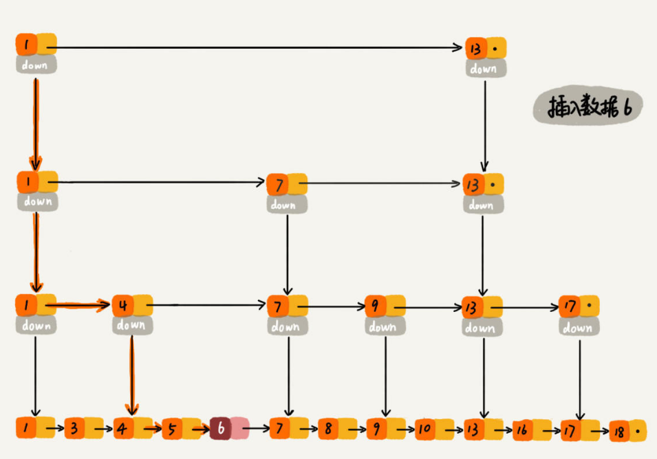

## 跳表

跳表的思想使得链表能够实现二分查找

#### 跳表的层高推导

##### 固定跨度推导跳表高度

先来求跳表的索引高度.如下图所示，假设每两个结点会抽出一个结点作为上一级索引的结点，
原始的链表有n个元素，则一级索引有`n/2`个元素、二级索引有 `n/4` 个元素、`k`级索引就有 `n/2k`个元素。
最高级索引一般有`2`个元素，即： 

    最高级索引 h 满足
       2 = n/2h，
    => h = log2n - 1，

最高级索引`H`为索引层的高度`h`加上原始链表锁在的一层,则跳表的总高度`h = log2n`  

    

##### 熟悉一下跳表的查找流程,推导查找操作的时间复杂度

我们看上图中加粗的箭头，表示查找元素`x`的路径，那查找过程中每一层索引最多遍历几个元素呢？

 1. 首先从第k级索引开始查找，
 1. 我们发现要查找的元素`x`比`y`大比`z`小，所以，需要从`y`处下降到`k-1`级索引继续查找，
 1. `k-1`级索引中比`y`大比`z`小的只有一个`w`，所以在`k-1`级索引中，遍历的元素个数为`y`、`w`、`z` 共计三个.
 1. 发现`x`比`w`大比`z`小之后，下降到`k-2`级索引,`k-2`级索引最多遍历的元素为 `w`、`u`、`z` 共计三个.
 
其实每级索引都是类似的道理，每级索引中都是`两个结点`抽出`一个结点`作为上一级索引的结点.
现在我们得出结论：**当每级索引都是两个结点抽出一个结点作为上一级索引的结点时，每一层最多遍历3个结点.**

跳表的索引高度
 
        h = log2n，
        
所以跳表中查找一个元素的时间复杂度为

        O(3*logn) 省略常数即：O(logn)

##### 跳表的空间复杂度

创建索引时如果跨度是`2`,则空间复杂度是`O(n)`.如果每三个结点抽一个结点做为索引，索引总和数就是 `n/3 + n/9 +  n/27 +  … 9 3 1 `.
**我们可以通过较少索引数来减少空间复杂度，但是相应的肯定会造成查找效率有一定下降**.

>索引结点往往只需要存储`key`和几个指针，并不需要存储完整的对象，所以当对象比索引结点大很多时，索引占用的额外空间就可以忽略了.
>这很像B+树的分支结点.

#### 在跳表中插入一个元素

插入数据看起来也很简单，跳表的原始链表需要保持有序，所以我们会向查找元素一样，找到元素应该插入的位置。
如下图所示，要插入数据`6`，插入过程等价于查找`6`的位置,然后进行插入，查找路径为 `1、1、1、4、4、5`。
查找到第底层原始链表的元素`5`时，发现`5`小于`6`但是后继节点`7`大于`6`，所以应该把 6 插入到`5,7`之间。
插入操作时间复杂度为查找元素的时间复杂度 `O(logn)`。

上边直接插入元素,并没有在插入元素后去更新整个跳跃表的索引.
假如一直往原始列表中添加数据，但是不更新索引，就可能出现两个索引节点之间数据非常多的情况，极端情况，跳表退化为单链表，从而使得查找效率从`O(logn)`退化为 `O(n)`.
(红黑树的插入/查找/删除操作的时间复杂度最坏为`O(logN)`)
(二叉平衡树的插入/查找/删除操作的时间复杂度平均为`O(logN)`数量级,但是要维持强平衡,效率没有红黑树高)

为了避免查找效率的退化,我们应该维护索引,有一下两种主要方案.

 - 完全重建索引     每次插入数据后，都把这个跳表的索引删掉全部重建,此时插入操作的时间复杂度退化为`O(n)`
 - 概率重建N层索引  每层索引的元素个数已经确定，且每层索引元素选取的足够随机，所以可以通过索引来提升跳表的查找效率。当建立二级索引的时候，同时也会建立一级索引；当建立三级索引时，同时也会建立一级、二级索引. `Redis`的`zset`中`SKIPLIST_P`设定的`0.25`
 
所以跳表插入数据到各层索引中，最坏时间复杂度是`O(logn)`.  
同理跳表删除结点时，最坏时间复杂度是`O(logn)`.  

#### 上一下Redis中跳表的结构体

    typedef struct robj {
        char str[100];
    } robj;

结点结构
    
    typedef struct skipListNode {
    
        // 层
        struct skipListLevel{
            struct kipListNode * froward;    // 前进指针  用于访问位于表尾方向的其它结点
            unsigned int span;               // 跨度     记录前进指针所指向的结点跟当前结点的距离. 当程序从表头 向 表尾进行遍历时 访问会沿着层的指针进行
        } level[];
    
        struct skipListNode * backward;      // 后退指针  指向当前结点的前一个结点 在程序从表尾向表头遍历时使用
    
        double score;
    
        struct robj *obj;
    
    } skipListNode;

跳表结构
    
    typedef struct skipList {
    
        // 跳表的头结点 尾结点
        struct skipListNode * header;
        struct skipListNode * tail;
        unsigned long length;  // 跳跃表的长度 即表中结点的数量
        int level;             // 在目前的跳跃表中 层数最大的那个结点的层数
    
    } skipList;

#### 为什么Redis选择使用跳表而不是红黑树来实现有序集合？

Redis 中的有序集合(zset) 支持的操作：

 - 插入一个元素
 - 删除一个元素
 - 查找一个元素
 - 有序输出所有元素
 - **按照范围区间查找元素（比如查找值在`[100, 356]`之间的数据）**

其中，前四个操作红黑树也可以完成，且时间复杂度跟跳表是一样的。但是，按照区间来查找数据这个操作，红黑树的效率没有跳表高。
按照区间查找数据时，跳表可以做到 `O(logn)` 的时间复杂度定位区间的起点，然后在原始链表中顺序遍历即可，非常高效。
而且跳表实现起来比红黑树简单.更容易理解.

#### 原文连接

原文链接：https://blog.csdn.net/qq_34412579/article/details/101731935 
