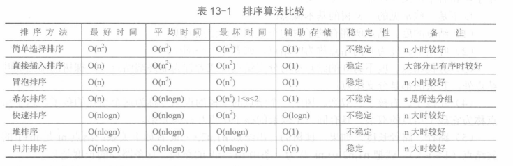

## 各种排序算法比较

先上表

是否稳定

 - 稳定排序 冒泡排序 直接插入排序 归并排序
 - 不稳定   简单选择排序 快速排序 希尔排序 简单选择排序

时间复杂度()

 - `O(n^2)`阶     简单选择排序/直接插入排序/冒泡排序   
 - `O(nlogn)`阶   快速排序/堆排序/归并排序

在`O(nlogn)`阶中,快速排序最坏情况只有两种，并且通过随机化算法可以避免，因此这三种算法时间复杂度可以说是一样的。
三者之间比较,据说`快速排序>堆排序>归并排序`,归并落后的原因显而易见,但是快排与堆排序,因为我的理论支持还不足,没有办法从理论层面
给出有力的证明.
    
空间复杂度

