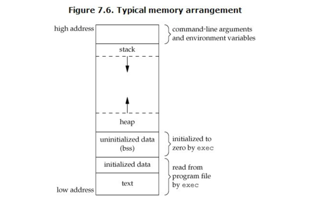

# 栈为什么要由高地址向低地址扩展

这是来自apue里一张经典的ｃ程序内存分布图

着重看一下heap和stack的内存分布
试着想一下如果让你来设计，你会怎么办
heap从低地址向高地址扩展，做内存管理相对要简单些。
**stack从高地址向低地址扩展，这样栈空间的起始位置就能确定下来，动态的调整栈空间大小也不需要移动栈内的数据。**

### 其它解释

内存的一端放置了静态代码和静态数据之后，剩余的区域，既需要动态数据，又需要可增长的栈，那么合理的方案就是各放一端向中间生长。
现在的问题就是两个选项：

 1. 静态内存放在哪端
 1. 栈是在静态内存的同端还是对端

历史程序特征

 - 高地址向低地址生长.数组、字符串越界时会覆盖过去栈帧的数据，黑客更容易找到缓冲区溢出攻击的漏洞
 - 一些特殊的CPU设计者刻意选用向高地址扩展，该架构有助于防御缓冲区溢出攻击.
        

现代程序的下列特征，导致内存布局问题中的单个栈增长方向无所谓。

 - 使用线性虚拟地址，进程空间为4G或者更高
 - 现代程序写法，栈的大小1M左右已经足够使用。编译器一般都直接限制栈的大小
 - 多线程导致有多个栈，所以堆-栈的两端分割模式是不合适的，每个栈应当有界

### 巨人肩膀

https://www.zhihu.com/question/29520755