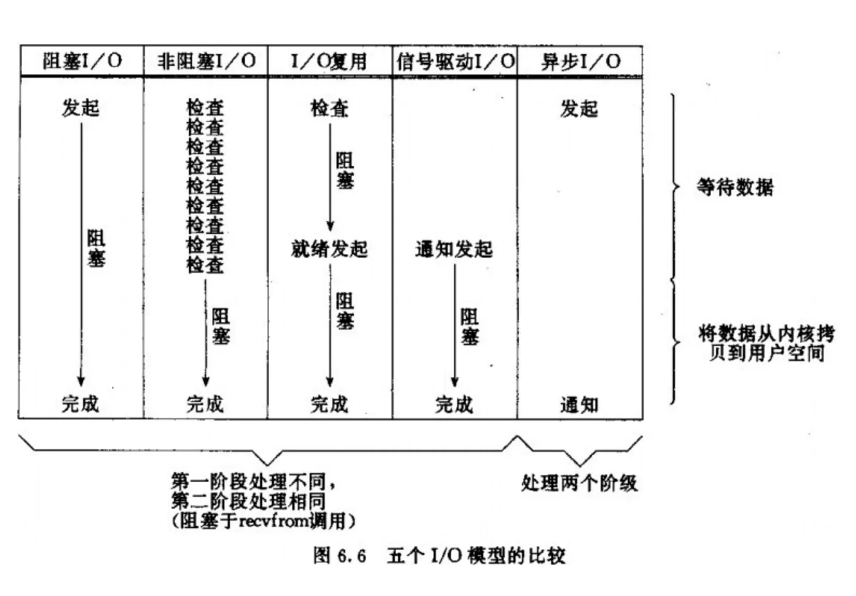

## 五种IO模型

#### 阻塞的后果

 - 进程阻塞后,让出CPU.等待操作系统调度.当进程想要获取的数据就绪时,操作系统会将进程调度到就绪队列.等待CPU.
 - 多线程环境中,一个线程阻塞后,出让CPU给其它线程.自身进入阻塞状态.等待操作系统调度.
 
所以阻塞会使当前CPU使用者失去对CPU的使用权. 

#### IO的两个阶段

 1. 数据准备阶段
 2. 数据拷贝阶段 

进程发起阻塞式系统调用`recvfrom`,想要读取`socket`数据,内核发现该`socket`上没有数据到达,进程挂起.
当`socket`上有数据到达时,内核将数据`copy`到进程的缓冲区,当到数据`copy`完成后操作系统唤醒进程.

##### Linux下五种`I/O`模型

 - `阻塞I/O`    从发起系统调用开始,阻塞进程直到数据拷贝完成 
 - `非阻塞I/O`  进程反复调用IO函数(自身进程反复轮询内核),可以立刻通过函数的返回值知道数据是否就绪.第一阶段不阻塞.如果数据准备就绪,内核进行数据拷贝阶段进程是阻塞.
 - `I/O复用`    进程不直接发起系统调用`recvfrom`,改为发起系统调用`select`或者`poll`或者`epoll（Linux 2.6+）`.
    将想要监听的`IO FILE * hanlder`注册到监听队列中,`select`或者`poll`通过轮询的方式监活跃的`IO`.然后通知对应进程.不需要`fork`和多进程就可以实现并发服务的`server`。
 - `信号驱动I/O` 首先我们允许`Socket`进行信号驱动`IO`,并安装一个信号处理函数，进程继续运行并不阻塞。当数据准备好时，进程会收到一个`SIGIO`信号，可以在信号处理函数中调用`I/O`操作函数处理数据。
    有时也称此方式为异步I/O。但是严格讲，该方式并不能算真正的异步I/O，因为实际读取数据到应用进程缓存的工作仍然是由应用自己负责的。  
 - `异步I/O` `AIO`   异步IO不是顺序执行(主要依靠回调执行).用户进程进行`aio_read`系统调用之后，无论内核数据是否准备好，都会直接返回给用户进程，然后用户态进程可以去做别的事情。等到socket数据准备好了，内核直接复制数据给进程，然后从内核向进程发送通知。**IO两个阶段，进程都是非阻塞的**。
    **事件驱动是异步的实现方式，而回调函数是事件驱动的实现方式**
    
我个人感觉应该把epoll归类到`异步I/O`这一类.     

`I/O`模型进化史

 - `阻塞I/O`，`非阻塞I/O`  缺点：需要一个进程监听一个`IO`，浪费系统资源
 - `I/O复用`  一个进程就可以监听N个`IO`,轮询监听. 缺点：惊群问题 C10K问题
 - `信号驱动I/O` SIGIO是需要用到信号量的, 资源太受限制,不适用TCP协议 
 - `异步I/O` `AIO`  告知内核启动某个操作，并让内核在整个操作完成后再通知我们.(包括将数据从内核复制到我们进程的缓冲区),缺点：从程序员角度理解难度大.目前还不成熟.  

（笔记之好混乱 。。。）

使用IO的方式主要有以下三种

 - 同步
 - 异步
 - 基于事件驱动 (个人理解即便是异步,它的基础也是同步) (可不可以用hash取代轮询哇 哈哈哈)
 
**事件驱动是异步的实现方式，而回调函数是事件驱动的实现方式**。 

虽然使用IO模型的方式有三种,但是基于一些使用上的冲突,所以只有以下固定搭配.

 - `同步阻塞I/O`，
 - `同步非阻塞I/O`
 - 基于事件驱动的`异步非阻塞I/O`
 - `I/O复用`   
 - `异步I/O`  

#### 五种IO模型的比较

