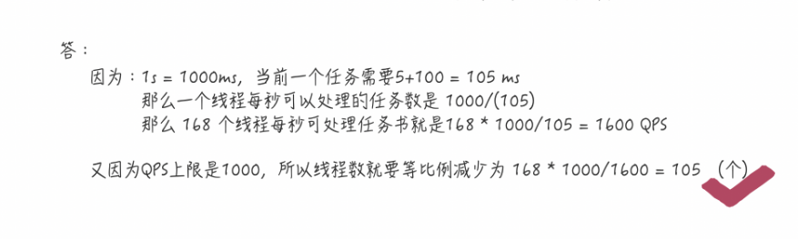

## 创建多少个线程合适

#### 创建多少个线程合适？

面试如果问到这个问题，这可是对你理论和实践的统考。日常工作场景中有`CPU密集型`和`I/O密集型`两个场景，不同的场景当然需要的线程数也就不一样了.

#####`CPU密集`型程序创建多少个线程合适？

有些同学早已经发现，对于`CPU密集`型来说，理论上 `线程数量` = `CPU逻辑核数` 就可以了，但是实际上，数量一般会设置为`CPU逻辑核数 + 1`， 为什么呢？
`《Java并发编程实战》`这么说:

> 计算密（CPU）集型的线程恰好在某时因为发生一个页错误或者因其他原因而暂停，刚好有一个“额外”的线程，可以确保在这种情况下CPU周期不会中断工作。
>

所以对于CPU密集型程序,`CPU逻辑核数 + 1`个线程数是比较好的经验值的原因了.

##### `I/O密集型`程序创建多少个线程合适？

上面已经让大家按照图多画几个周期（你可以动手将I/O耗时与CPU耗时比例调大，比如6倍或7倍），这样你就会得到一个结论，对于`I/O`密集型程序：

    最佳线程数 = (1/CPU利用率) 
    => 1 / (CPU耗时 / (I/O耗时 + CPU耗时))
    => 1 + (I/O耗时/CPU耗时) 

这是一个CPU核心的最佳线程数，如果多个核心，那么`I/O`密集型程序的最佳线程数就是：

    最佳线程数 = CPU核心数 * (1/CPU利用率) = CPU核心数 * (1 + (I/O耗时/CPU耗时))

说到这，有些同学可能有疑问了，要计算`I/O`密集型程序，是要事先知道`CPU利用率`的，如果我不知道这些，那要怎样给出一个初始值呢？
按照上面公式，假如几乎全是I/O耗时，所以纯理论你就可以说是 2N（N=CPU核数），当然也有说`2N+1`的，（我猜这个 1 也是 backup），
没有找到具体的推倒过程，在【并发编程实战-8.2章节】有截图在此，大家有兴趣的可以自己看看.

理论上来说，理论上来说，理论上来说，这样就能达到`CPU 100%`的利用率.如果理论都好用，那就用不着实践了，也就更不会有调优的事出现了。
不过在初始阶段，我们确实可以按照这个理论之作为伪标准， 毕竟差也可能不会差太多，这样调优也会更好一些.

谈完理论，咱们说点实际的，公式我看懂了，但是我有两个疑问：

 - 我怎么知道具体的 I/O耗时和CPU耗时呢？
 - 怎么查看CPU利用率？
 
有很多 `APM （Application Performance Manager）`工具可以帮我们得到准确的数据，学会使用这类工具，也就可以结合理论，
在调优的过程得到更优的线程个数了。我这里简单列举几个，具体使用哪一个，具体应用还需要你自己去调研选择，受篇幅限制，暂不展开讨论了.

 - SkyWalking
 - CAT
 - zipkin
 
上面了解了基本的理论知识，那面试有可能问什么？又可能会以怎样的方式提问呢？

#### 面试小问

##### 小问一

假设要求一个系统的 `TPS（Transaction Per Second 或者 Task Per Second）`至少为20，然后假设每个`Transaction`由一个线程完成，
继续假设平均每个线程处理一个Transaction的时间为`4s`,如何设计线程个数，使得可以在`1s`内处理完20个Transaction？
    
    假设服务器为单个CPU.
    单个线程的TPS 1/4 = 0.25
    题目可以简化为: 已知需要完成的Task总数为 20,以及单个线程每秒可以完成的Task数为 0.25,求需要多少个线程
    
    20 / 0.25 = 80个. 

这是服务器单个CPU的情况。一般服务器的CPU核数为`16`或者`32`，如果有`80`个线程，
那么肯定会带来太多不必要的线程上下文切换开销（希望这句话你可以主动说出来），
这就需要调优了(根据服务器的实际运行情况以及网络状况进行专门调整,来做到最佳balance).

##### 小问二

计算操作需要`5ms`，DB操作需要`100ms`，对于一台8个CPU的服务器，怎么设置线程数呢？

    解题过程分析
    
    计算操作需要5ms，DB操作需要 100ms，对于一台 8个CPU的服务器，怎么设置线程数呢？
    => CPU计算需要5ms，IO操作需要100ms，对于一台8个CPU的服务器，怎么设置线程数呢？
    => 线程数 = 8 * (1 + 100/5 ) = 168 (个)

那如果DB的`QPS（Query Per Second）`上限是`1000`，此时这个线程数又该设置为多大呢？

    解题过程分析
    按QPS无限制情况计算8个CPU可以支撑的最大QPS.
    等比例缩放
        
    

同样，这是没有考虑 CPU 数目，接下来就又是细节调优的阶段了
因为一次请求不仅仅包括`CPU`和`I/O`操作，具体的调优过程还要考虑内存资源，网络等具体内容.

##### 增加 CPU 核数一定能解决问题吗？

看到这，有些同学可能会认为，即便我算出了理论线程数，但实际CPU核数不够，会带来线程上下文切换的开销，所以下一步就需要增加 CPU 核数，
那我们盲目的增加 CPU 核数就一定能解决问题吗？

>阿姆达尔定律
>这个结论告诉我们，假如我们的串行率是5%，那么我们无论采用什么技术，最高也就只能提高20倍的性能。

如何简单粗暴的理解串行百分比（其实都可以通过工具得出这个结果的）呢？
>Tips: 临界区都是串行的，非临界区都是并行的，用单线程执行临界区的时间/用单线程执行(临界区+非临界区)的时间就是串行百分比.

现在你应该理解我在讲解`synchronized`关键字时所说的：
>最小化临界区范围，因为临界区的大小往往就是瓶颈问题的所在，不要像乱用try catch那样一锅端

##### 总结

多线程不一定就比但线程高效，比如大名鼎鼎的`Redis`。而多线程的使用场景一般时存在相当比例的`I/O`或网络操作.
另外，结合小学数学题，我们已经了解了如何从定性到定量的分析的过程，在开始没有任何数据之前，我们可以使用上文提到的经验值作为一个伪标准，
其次就是结合实际来逐步的调优（综合 CPU，内存，硬盘读写速度，网络状况等）了.最后，盲目的增加CPU核数也不一定能解决我们的问题，
这就要求我们严格的编写并发程序代码了.

##### 灵魂追问

 - 我们已经知道创建多少个线程合适了，为什么还要搞一个线程池出来？
 - 创建一个线程都要做哪些事情？为什么说频繁的创建线程开销很大？
 - 多线程通常要注意共享变量问题，为什么局部变量就没有线程安全问题呢？
......

##### 参考地址

原文链接：https://blog.csdn.net/yusimiao/article/details/105378311