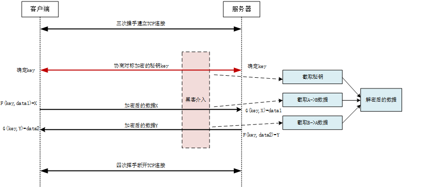
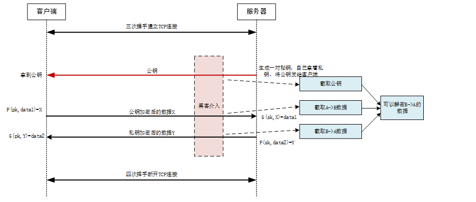

## https加密技术实现原理

https与http的区别

 - https保证在网络中传输的数据是经过加密的,而不是明文.防止中间人进行抓包分析.
 - https能够验证服务器身份,保证访问的站点是官方站点而不是山寨站点,避免中间人攻击.

所以:http与https最核心的区别就是 https是一个安全的传输协议.

#### 基本概念

 - 数字签名  对源字符串进行压缩提取信息摘要,常用来验证源字符串经过传输后是否被篡改.
 - 数字证书  数字证书里包含`明文T`，`数字签名S`两段重要信息,其中`明文T`中包括`证书持有者`(比如域名,域名所有者等信息)、`证书持有者的公钥`等信息. 
 - CA证书颁发机构 网站身份证制作中心.
 - 根证书  操作系统、浏览器本身会预装一些它们信任的证书,我们称为`根证书`.
 - 信任链  证书之间的认证也可以不止一层，可以A信任B，B信任C，以此类推，我们把它叫做`信任链`或`数字证书链`，也就是一连串的数字证书，由根证书为起点，透过层层信任，使终端实体证书的持有者可以获得转授的信任，以证明身份。

#### https的加密问题

首先我们必须明确一点,默认情况下加密算法为 黑客与服务端/客户端 共同知晓,只是在密钥的知晓权上不同.

##### 对称加密

服务端将密钥发送到客户端,两者同时使用这一个密钥进行数据加密.

客户端

    key = 服务端通过tcp发送过来的密钥.
    request_params = {...};
    real_send = custom_encode(key,request_params);
    send 到 服务端
    
服务端 

    received_params
    real_received = custom_decode(key,received_params);

只使用对称加密的时序图

    
从图中可以看出，客户端和服务器之间如果只使用对称加密技术，则始终需要商议一个加密用的秘钥（key，例如一个随机字符串）。
在这个商议的过程中，黑客就可以介入进行截取，只要黑客获取到这个key，那么后面的对称加密就完全失效了。

##### 非对称加密

在公钥密码体制中

 - 加密密钥PK(public key 即公钥)是向公众公开的,并且客户端接收到服务器颁发的公钥都是相同的.
 - 解密的密钥(secret key即私钥或者秘钥)时需要保密的.
 - 加密算法E(encryption),解密算法D(decrypt)也都是公开的.

鉴于非对称加密的机制，我们可能会有这种思路：

 1. TCP三次握手成功以后,服务器先把公钥直接明文传输给浏览器
 1. 浏览器向服务器传数据前使用公钥加密,只有服务器拥有私钥才可以进行解密.相应的,浏览器要接收服务器发送给它的数据(**服务器使用私钥加密后的数据**),浏览器可以用建立链接时get的公钥进行解密.
 
但是这个流程存在一个问题,如果公钥在传输过程中被劫持,存在以下安全隐患.

虽然劫持者可以截取浏览器向服务器发送的数据,但是劫持者并不能使用公钥逆向解析出浏览器发送的原始数据.但是劫持者可以以用公钥解密得到来自服务器的加密数据,从而获得一些敏感信息,例如联系方式，住址等等.
也就是说**通过一组公钥私钥,可以保证单个方向传输的安全性**.

看一下只使用非对称加密的时序图

 
针对这个问题,有一个过渡方案,`通过一组公钥私钥,可以保证单个方向传输的安全性`,那么我们就用`通过两组公钥私钥,可以保证两个方向传输的安全性`.
 
 1. 某网站服务器拥有用于非对称加密的`公钥A`、`私钥A`.浏览器拥有用于非对称加密的`公钥B`、`私钥B`.
 1. 浏览器向网站服务器发起请求,服务器将公钥A明文发送到浏览器.
 1. 向对应的浏览器把`公钥B`明文发送到服务器.

此时: 
 
 - 浏览器向服务器传输的所有数据都使用`公钥A`加密，服务器收到后用`私钥A`解密. 保证`浏览器->服务器`方向的安全.
 - 服务器向浏览器传输的所有数据都使用`公钥B`加密，浏览器收到后用`私钥B`解密. 保证`服务器->浏览器`方向的安全.

看起来很严谨的样子,但是这种方案仍然存有一个隐患,`非对称加密解密性能比较低,当传输大文件时,会严重拖慢性能`,所以https的加密没有使用这种方案.

我们知道,对称加密速度快,但是没有办法解决密钥的安全传输问题.**非对称加密虽然慢,但是可以保障单方向传输的安全性**.我们可以采用`对称加密 + 非对称加密`的组合方式,
并尽量减少`非对称加密解密`的使用次数,就可以同时兼顾`安全性`与`高效性`了. 

看一下这个过程：

 1. 某网站服务器拥有用于非对称加密的`公钥A`、`私钥A`.
 1. 浏览器向网站服务器发起请求,服务器将公钥A明文发送到浏览器.
 1. 浏览器随机生成一个用于对称加密的`密钥X`，用公钥A加密后传给服务器.**注意:用于对称加密的密钥是由浏览器产生的!!!**,因为从`浏览器`到`服务端`这个方向的数据是安全的. 
 1. 服务器拿到后用`私钥A`解密得到`密钥X`.
 1. `浏览器`,`服务端`同时拥有`密钥X`,第三方无法获得`密钥X`.之后双方所有数据都通过密钥X加密解密.

是不是要感叹一声完美,`https`基本就是采用了这种方案.
 
>密钥加密机制的破解,在逻辑上是可能的,但是在目前的计算速度下是不可能的,所以我们称呼其为-计算上是安全的.
未来如果量子计算机真的出现,那么这些算法就要重新洗牌了.作为程序员要坚信:世界上没有绝对安全的系统.

#### 道高一尺 魔高一丈  

世界上没有任何东西是完美的.上边的`对称加密 + 非对称加密`组合被安排了.

通过采用上述组合,截持者的确无法得到浏览器生成的`密钥X`了.然而中间人却完全不需要拿到`密钥X`就能安排你.
(因为信号在硬件中传输机制,我们传输的信息在都是可以被其它主机拦截的,就像我们托邮递员送信,将信的内容会不会泄露寄希望于邮递员的素质一样.)

 1. 某网站拥有用于非对称加密的`公钥A`、`私钥A`。
 1. 浏览器向服务器请求，服务器把`公钥A`明文发送到浏览器。
 1. 中间人劫持到公钥A，保存下来，把数据包中的公钥A替换成自己伪造的`公钥B`（当然它同时也伪造了`公钥B`对应的`私钥B`,做就要做全套)。
 1. 浏览器随机生成一个用于对称加密的`密钥X`，用`公钥B`（浏览器不知道公钥被替换了）加密后传给服务器,中间人继续劫持请求,用`私钥B`解密得到`密钥X`，再用`公钥A`加密后传给服务器。
 1. 服务器拿到后用`私钥A`解密得到`密钥X`。

这样在双方都不会发现异常的情况下，中间人得到了`密钥B`.这就像放在冰箱中的雪糕都被人舔过一样恶心.
这种现象发生的根本原因是:**浏览器无法确认自己收到的公钥是来自官方还是来自第三方**.
问题产生的原因就是解决问题的办法:`客户端需要具有辨认自己请求的服务器是否为官方服务器,而不是第三方伪造的服务器的能力`.

联系我们的现实生活,我们如何证明`我是我`呢？这就需要权威的公安居颁发的身份证,证明`你`是`真的你`.
互联网中需要一个公信机构呢,给网站颁发一个`身份证`.接下来推导:如何证明浏览器收到的公钥一定是该网站的公钥？

浏览器验证过程：

 1. 服务器向`CA机构`申请证书,将`CA机构`为该网站制作的`数字证书`存储在网站服务器上.
 1. 建立TCP连接后,浏览器拿到服务器发送过来的证书,证书内容包括:`明文T`，`数字签名S`两部分.(`明文T`里包含`服务器公钥`等重要信息)
 1. 用CA机构的公钥对`S`解密得到`S’`(由于是浏览器信任的机构,所以浏览器自带CA机构的公钥,另外操作系统也会预先安装一些信任的根证书).
 1. 用CA机构制作证书时使用的`hash`算法对`明文T`进行`hash`得到信息摘要`T’`.
 1. 比较`S’`是否等于`T’`,等于则表明证书可信,浏览器直接与官方建立了连接,没有第三方赚差价.

重放一下中间人攻击的场景:

 - 假设中间人篡改了证书的原文，由于他没有CA机构的私钥，所以无法得到此时加密后签名.
 - 中间人把证书整个掉包,因为证书里包含了网站信息,包括域名操作等同于上面的篡改证书,禁止操作.

几个常见疑问点明确：

 - question.1 服务器颁发给不同的客户端浏览器的证书，证书内容里的非对称公钥是不是都是不一样的?
 - answer: 都一样的
 
>其实,这也不是绝对安全.你要保障系统的安全必须维护整个链路都是安全的,但是如果你要渗入系统,只要找到一个漏洞即可.

比如:

服务器返回的证书是可以被调包的，但是客户端要信任被调包的证书才行，这是charles抓https请求的原理.

#### hash加密

hash可以用来提取信息摘要.根据hash值与源文件,我们可以验证我们下载的文件是否与源文件相同.

 - eg.1 我们在centos官网下载操作系统镜像时,官方网站一般会提供一个`源码包 + md5的哈希值`.
我们下载完源码之后,对该源码包使用md5进行摘要提取,然后与g官方提供的摘要进行对比,就可以验证我们所下载的安装包是否经过篡改.

 - eg.2 在上传文件时,我们可以对文件进行md5提取摘要,对摘要相同的文件只需保存一个即可,减少空间的浪费.(网盘也是这个原理).

#### 原文链接

cnblogs https://www.cnblogs.com/Leo_wl/p/13047692.html

知乎 https://zhuanlan.zhihu.com/p/43789231