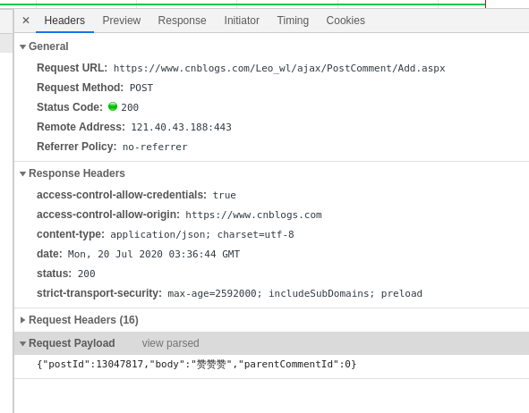

## 如何保障API的安全性

#### 引子

前段时间，公司对运行的系统进行了一次安全扫描，使用的工具是 IBM 公司提供的 AppScan 。
这个正所谓不扫不要紧，一扫吓一跳，结果就扫出来这么个问题。
我们的一个年老失修的内部系统，在登录的时候，被扫描出来安全隐患，具体学名是啥记不清了，大致就是我们在发送登录请求的时候，
有个字段名是 password ， AppScan 认为这个是不安全的，大概就是下面：

我第一个反应是把这个字段名字改一下，毕竟能简单解决就简单解决嘛，结果当然是啪啪啪打脸。
这个名字我不管是换成 aaa 还是 bbb ，再次扫描都还会报同样的问题，唯一不同的地方就是安全报告上的字段名换一换。
这个就有意思了，这个问题是来者不善啊，经过我一翻查找（别问我怎么查的，问就是瞎猜的），找到原因的所在了。

因为我们这个系统是一个内部系统，当时做登录这个人比较图懒，就在页面上简单的做了个 form 表单提交，就比如这样：
    
    <html>
        <form>
            <input type="text" name="username" ></input>   
            <input type="password" name="pwd" ></input>   
        </form>   
    </html>

这个代码我曾经在大学的大作业上这么写过，没想到时隔多年我竟然又见到了这样的代码，竟然让我有一种老乡见老乡的特殊情感。
这个问题具体的原因是 AppScan 是直接检测页面上 type='password' 的输入框，然后再检查请求中是否有对应的字段.

#### 第一阶段 客户端分析与请求伪造

攻击者在浏览器的`network`中进行抓包，这个请求中的数据攻击者可以看的清清楚楚.攻击者可以先通过正规的途径进行访问，
当分析清楚我们的数据字段构造与发送规则后再对请求进行伪造，开始攻击.

例如:支付宝网页端的登录接口，如果能搞清楚其中请求的发送规则，攻击者就可以使用买来的用户数据库,
进行批量撞库测试，通过请求响应的结果就可以验证一批的支付宝的账号密码.

那么相应的,如果我们要预防请求伪造,就需要从以下两个方面入手

 1. 对参数部分进行部分或者整体加密,禁止明文发送
 1. 降低发送规则部分代码的可读性,防止逆向.

##### 对请求体进行整体加密.

正常我们的请求都是呈键值对格式分布的,浏览器的`debug tools`贴心的为我们格式化布局.这样参数的可读性比较高,但是同样攻击者读起来也很方便.

观察上图中的末尾行`payload`是不是一目了然.这是因为我们在提交http请求时使用了`post`方式中的 `form-data`格式.
在服务端,我们可以使用`$_POST`进行接收.现在我们对提交的整体使用密钥进行一次加密.然后放到请求中.

虽然这样我们就不能在服务端直接使用`$_POST`进行接收了.但是它所带来的抗解读性是非常高的.

整体加密会使用哪些算法 

 - 对称加密    客户端与服务端使用相同的密钥加密. 常见`DES`,`AES`,`RC4`,`RSA` 
 - 非对称加密  服务端会生成一对密钥，私钥存放在服务器端，公钥可以发布给客户端. 优点就是比起对称加密更加安全，但是加解密占用资源多.

##### 抗分析

在当今的互联网时代，网页和APP成为了主流的信息载体。其中`APP`是可以使用一些`加固技术`对`APP`进行加固，防止别人进行暴力破解。
而网页就比较困难了，网页的数据动态处理都是依靠`JavaScript`来完成的,(比如加密请求参数).逻辑是依赖于`JavaScript`来实现的，而`JavaScript`又有下面的特点：

 - JavaScript 代码运行于客户端，也就是它必须要在用户浏览器端加载并运行。
 - JavaScript 代码是公开透明的，也就是说浏览器可以直接获取到正在运行的 JavaScript 的源码。

基于这两点，**导致了`JavaScript`代码是不安全的，任何人都可以读取、分析、盗用、篡改 JavaScript代码。**
所以说， JavaScript 如果不进行一些处理，不管使用了如何高超的加解密方案，在被人找到其中的逻辑后，被模拟或者复制将变得在所难免。

前端`JavaScript`常见的加固方案有这么几种：

 - 压缩  去除 JavaScript 代码中不必要的空格、换行等内容 通过控制代码的格式来缩减可读性
 - 混淆  通过语法树替换实现的混淆器,它的目的就是使得 JavaScript 变得难以阅读和分析,`难以逆向`
 - 加密  基本思路是将一些核心逻辑使用诸如`C/C++`语言来编写，并通过`JavaScript`调用执行，从而起到二进制级别的防护作用。

#### 第二阶段 `中间人`/`第三方` 抓包破解

##### 1 防止数据在传输过程中被抓包

传输数据加密  
比如对 password  name 字段进行加密.防止敏感信息被别人抓取（帐号/联系方式...）  
http -> https

即使黑客获取了加密后的密码,他也不能做什么.

##### 2 防止数据在传输过程中被篡改

对传输数据生成数据签名， 就是对参数整体进行 信息摘要操作 一般采用 md5生成签名 
    
    
        
生成数据签名的过程是在客户端进行的,一般由js完成. 这里的`key`是一个密钥,由客户端和服务端各持有一份，最终登录请求要提交的`json`数据就会是下面这个样子：

    {
        "name": "test",
        "password": "123",
        "sign": "098f6bcd4621d373cade4e832627b4f6"
    }
    
**密钥是不参与数据提交，否则请求被劫持后，第三方就可以通过密钥自己生成签名**.
当然，如果觉得单纯的`MD5`不够安全的话，还可以在`MD5`的时候加盐和加`hash`,进一步降低请求被劫持后存在模拟的风险。
请求经过的加密和签名后，已经很难进行`逆向破解`了.

##### 3 DDOS攻击

攻击者他在抓包后，并不在意里面的具体数据，直接拿着抓的包进行攻击,靠量取胜.

 1. 限流/黑名单  令牌桶/漏桶/计数器
 2. 验证码  
 3. 时间戳  只处理最近2分钟内的请求
 4. AppID  对异常的客户端进行下线处理

## 原文地址

https://www.cnblogs.com/Leo_wl/p/13047817.html