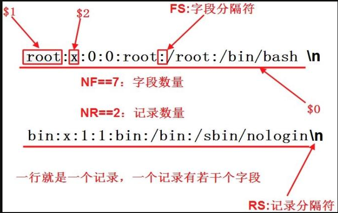
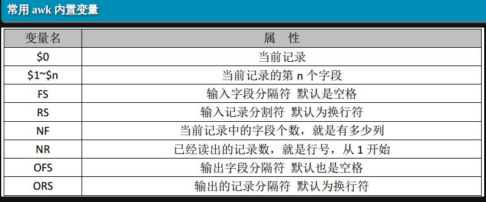

## awk 

输出内容的格式化，不会修改原文件.命令模式

    awk '{pattern + action}' {filenames}
    
 - 注意**使用单引号包裹花括号**
 - `pattern`表示awk在数据中查找的内容.
 - `action`是在找到匹配内容时所执行的一系列命令.
 - 通常，**awk是以文件的一行为处理单位的**,即对每一行应用一次`'{pattern + action}'`.

#### 基本概念
 
 - `RS` `Record Separator` 行分割符/记录分割符号  一行就是一条记录,一个文件根据行分割符号将整个文件内容切割为`n`行,我们可以自定义该分割符,默认为`\n`.
 - `FS` `Field Separator`  字段分割符,例如一行中含有多个单词,每个单词可以被认为是一个字段,单词与单词之间使用字段分割符界定.我们可以自定义该分隔符,默认为`FS="[[:space:]+]"`.(一个或者多个空白空格).
 - `NF` `Number of Field`  字段数量/字段序号
 - `NR` `Number of Record` 记录数量/行号
 
 

自定义分割符号,可以定义一个或者多个.新的分隔符使用单引号或者双引号包裹均可. 

    [sujianhui@dev0529 ~]$>awk -F":" '{print $1}' /etc/passwd
    [sujianhui@dev0529 ~]$>awk -F'[:r]' '{print $1}' /etc/passwd   // 以 : 或者 r 为分隔符进行分割 
    [sujianhui@dev0529 ~]$>awk -F'bin' '{print $2}' /etc/passwd    // 将bin当作一个分隔符进行 分割
    
`print`后面可以拼接字符串,**字符串使用双引号包裹**.
    
    [sujianhui@dev0529 ~]$>awk -F":" '{print "username : " $1}' /etc/passwd
    [sujianhui@dev0529 ~]$>awk -F":" '{print $1 " " $3}' /etc/passwd
    

#### `action{}` 块

`action{}`块可以不只有一个

    awk -F":" '{print $1}' /etc/passwd
    awk 'BEGIN {count=0;print "[start] user count is ",count} {count=count+1;print $0} END{print "[end] user count is ",count}' passwd

看起来很繁琐,其实拆解一下结构很清晰.上面的`BEGIN action{}`块与`END action{}`命名的块属于特殊块,他们类似于类的构造函数与析构函数.该块只会执行一次.
(不同于普通块,每一行都要执行一次).

 - `BEGIN action{}` 在开始处理输入文件之前会执行,适合初始化`FS`变量、打印页眉或初始化其它在程序中以后会引用的全局变量. 
 - `END action{}`   文件处理完成之后之后执行`END`块.通常`END`块用于执行最终计算或打印应该出现在输出流结尾的摘要信息.

`action{}`内部语句实质为类C语言的代码片段,可以在`action{}`内部使用.
之前的`action{}`里都是只有一个`print`,其实`print`只是一个语句，而`action{}`可以有多个语句，以`;`号隔开.其实就是**不换行的类C代码片段**.

##### 实例

>监测nginx的并发连接数

    [sujianhui@dev0529 bin]$>netstat -n | awk '/^tcp/ {++S[$NF]} END {for(a in S) print a, S[a]}'

**没明白$NF为什么等于最后一个字段  难道默认 print $NF 等价于 print $最后一个字段的序号？** 

>限定行范围，进行分割打印

    [sujianhui@dev0529 ~]$>awk -F':' '{if(NR>1 && NR<7) print $1;}' /etc/passwd
    bin
    daemon
    adm
    lp
    sync
    
>统计`/etc/passwd`的账户人数
   
    awk 'BEGIN {count=0;print "[start] user count is ",count} {count=count+1;print $1} END{print "[end] user count is ",count}' /etc/passwd
    
如果在块中直接使用一个未初始化的变量,默认初始值为`0`,但是显式初始化为`0`更加保险.

>使用判断结构

    awk 'BEGIN{a=11;if(a>=9){print "ok"}}' 

>字段分割符的花样用法

`FS="\t+"` 一个或多个Tab分隔

    awk 'BEGIN{FS="\t+"}{print $1,$2,$3}' tab.txt

`FS="[[:space:]+]"` 一个或多个空白空格，默认的

    awk -F [[:space:]+] '{print $1,$2,$3,$4,$5}' space.txt
    
`FS="[" ":]+"` 以一个或多个空格或：分隔

    awk -F [" ":]+ '{print $1,$2,$3}' hello.txt
    => awk -F ["sss":]+ '{print $1,$2,$3}' hello.txt  // 猜猜这个的分割规则

>字段数量`NF`的使用方式

取第二行

    ifconfig eth0 | awk -F [" ":]+ 'NR==2{print $4}' 
    ifconfig eth0 | awk -F [" ":]+ '{if(NR == 2)print $4;}' 

#### 参考资料

https://www.cnblogs.com/ginvip/p/6352157.html