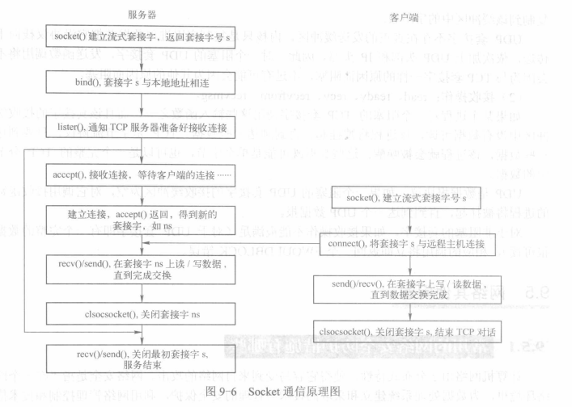

## socket

**任何协议都必须在发送消息体之前发送消息头（这也是为什么叫做“头”）**

主机字节序  
网络字节序  大端

IPv4和IPv6的地址格式定义在netinet/in.h
UNIX Domain Socket的地址格式定义在sys/un.h中，用sockaddr_un结构体表

    server_addr.sin_addr.s_addr = htonl(INADDR_ANY); // host to network long

网络地址为`INADDR_ANY`，这个宏表示本地的任意IP地址，因为服务器可能有多个网卡，每个网卡也可能绑定多个IP地址，
这样设置可以在所有的IP地址上监听，直到与某个客户端建立了连接时才确定下来到底用哪个IP地址，端口号为SERV_PORT，我们定义为8000。

IPv4和IPv6的地址格式定义在netinet/in.h中，IPv4地址用sockaddr_in结构体表示，包括16位端口号和32位IP地址，IPv6地址用sockaddr_in6结构体表示，
包括16位端口号、128位IP地址和一些控制字段。UNIX Domain Socket的地址格式定义在sys/un.h中，用sockaddr_un结构体表示。
各种socket地址结构体的开头都是相同的，前16位表示整个结构体的长度（并不是所有UNIX的实现都有长度字段，如Linux就没有），
后16位表示地址类型。IPv4、IPv6和UNIX Domain Socket的地址类型分别定义为常数AF_INET、AF_INET6、AF_UNIX。
这样，只要取得某种sockaddr结构体的首地址，不需要知道具体是哪种类型的sockaddr结构体，就可以根据地址类型字段确定结构体中的内容。
因此，socket API可以接受各种类型的sockaddr结构体指针做参数，
例如bind、accept、connect等函数，这些函数的参数应该设计成void *类型以便接受各种类型的指针，
但是sock API的实现早于ANSI C标准化，那时还没有void *类型，因此这些函数的参数都用struct sockaddr *类型表示，在传递参数之前要强制类型转换一下，例如：

    struct sockaddr_in servaddr;
    /* initialize servaddr */
    bind(listen_fd, (struct sockaddr *)&servaddr, sizeof(servaddr));

如果有大量的客户端发起连接而服务器来不及处理，尚未accept的客户端就处于连接等待状态，listen()声明sockfd处于监听状态，
并且最多允许有backlog个客户端处于连接等待状态,其它的拒绝连接

