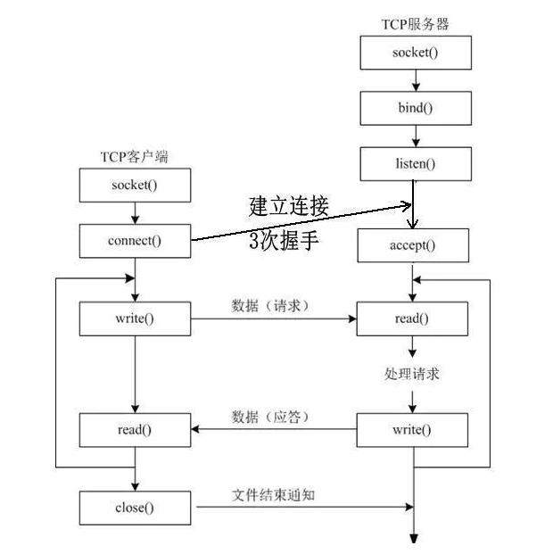

## TCP/IP

#### 为什么MAC地址不需要全球惟一

 - MAC地址可以通过软件进行修改，而第三方的山寨厂商不会在 IEEE 中申请独立的 MAC 地址段，它们也可能会盗用其他厂商申请的 MAC 地址；
 - 保证MAC地址在局域网中唯一就不会造成网络问题，不同局域网中的`MAC`地址可以相同；

#### 为什么tcp建立链接需要三次握手 ，两次握手可以不可以

两次握手不可以,三次握手主要是为了预防已经失效的历史链接请求报文突然又到达了B端.

#### 客户端与服务器正常创建链接后,如果客户端突然掉线,服务器会一直等待下去吗？

不会，服务器端TCP设有保活计时器,每一次收到客户端的数据，就重置该计时器,若两个小时没有接收到客户端数据，
服务器就向客户端发送一个探测报文,后每隔75s发送一次,若连续发送十次客户端都没有响应,那么服务端踢出该客户端.

#### 为什么需要等待2MSL/为什么需要TIME_WAIT阶段.

1 为了防止对端没有接收到ACk时,发起申请重传
2 等待阻塞在网络中的`连接请求报文`失效,

#### 服务器大量TIME_WAIT和CLOSE_WAIT的原因及解决办法

TIME_WAIT  刚刚主动断开了大量连接, 更改配置文件,快速回收资源
CLOSE_WAIT 程序出现问题,不能发送 FIN 报文.

#### 为什么握手需要三次，但是挥手需要四次

因为在握手阶段，当服务端接收到客户端的`连接请求`时,可以将回复的请求`确认应答请求ACK`和`连接请求`合并为一个请求`[S.]`.
因为创建连接就是要发送数据.但是挥手时,客户端向服务端发送了断开连接请求,这代表了

客户端没有数据需要向服务端发送了,但是不能代表服务端没有数据需要发送到客户端了.

**此时服务端的确认应答请求ACK,与FIN请求不能合并为一个包**.服务端应该首先发送ACK请求.然后发送哪些还未发送完成的数据.等所有数据完成发送之后.
再向客户端发送`FIN`请求.

#### TCP协议如何实现传输的可靠性

IP协议尽最大努力交付,不保证传输的可靠性,TCP依靠停止等待机制实现传输的可靠性.
停止等待机制 ：每发送完一个分组就停止发送,等待对方确认，收到确认后再发送下一个分组.对丢失的包自动重传.

#### TCP如何实现流量控制以及拥塞控制

通过滑动窗口实现流量控制.
流量控制：让发送方发送的不要太快,使接收方来得及接收.每次ACK时,接收方告诉发送方我还能接收多少个字节.发送方的发送窗口不能超过这个接收窗口大小.
(窗口单位是字节,不是报文段).
其它的就不太了解了.

#### ARP 与 RARP

ARP 地址解析协议 根据IP获得MAC地址

1 检查本地ARP缓存中是否有该IP对应的MAC地址
2 如果没有则向网络发送广播请求,
3 同一网络的其它主机接收到广播请求.比对IP地址与自己的IP地址.如果不同则忽略.如果相同则将源主机信息添如自己的本地ARP缓存中.并将自己的MAC地址发送回源主机.

RARP 是 ARP的反向解析过程

广播获得IP，然后进行通讯.

#### ping命令

ping命令发送ICMP请求。用来检查网络是否通畅以及网络连接速度.

#### 